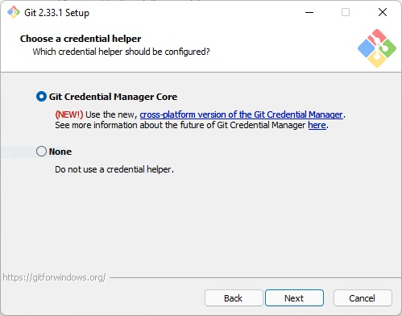

# Конвейер `Выгрузка истории хранилища 1С в git-репозиторий`

Конвейер поможет автоматизировать выгрузку истории хранилища 1С в git-репозиторий. Внутри используется приложение
[gitsync](https://github.com/oscript-library/gitsync).

## Пример конфигурационного файла `gitsync.json`

Описание и базовые настройки pipeline `gitsync`.

```json
{
  "agent": "gitsync",
  "v8Version": "8.3.20.1674",
  "defaultInfobase": {
    "connectionString": "/FC:/tmp/demo",
    "auth": "IDsecretJenkins"
  },
  "stages": {
    "gitsync": true
  },
  "gitsync": {
    "useTemporaryInfobase": true,
    "tempPath": "./out/tmp",
    "auth": "IDsecretJenkins"
  }
}
```

* `"agent"` - Имя или метка Jenkins-агента на котором будет выполняться pipeline
* `"v8version"` - Версия платформы 1с
* `"defaultInfobase"` - информационная база по умолчанию, используется во всех последующих этапах (в проверочном контуре проекта 1с)
  * `"connectionString"` - строка подключения к ИБ 1с
    * Файловая база внутри репозитория `/F./build/ib`
    * Файловая база вне репозитория `/FC:/tmp/demo`
    * Серверная база
  * `"auth"` - идентификатор секрета в Jenkins (логин и пароль пользователя ИБ 1с)
* `"stages"` - описание этапов pipeline
  * `"gitsync"` - возможные значения `true` / `false`
* `"gitsync"` - параметры
  * `"useTemporaryInfobase"` - использовать временную информационную базу 1с
  * `"tempPath"` - путь к каталогу с временными файлами
  * `"auth"` - идентификатор секрета Jenkins (логин и пароль пользователя хранилища 1с).

## Пример конфигурационного файла `gitsync_conf.json`

Пример конфигурационного файла `gitsync_conf.json` с использованием нескольких хранилищ 1с.

```json
{
  "globals": { // общий настройки
    "lic-try-count": 5, // количество попыток получения лицензии 1C
    "plugins": { // плагины из проекта gitsync-plugins
      "enable": [
        "check-authors", // проверка наличия авторов
        "increment" //инкрементальная выгрузка из хранилища (по возможности)
      ]
    },
    "plugins-config": { // настройки плагинов
      "push-n-commits": 0, // количество коммитов для push
      "push-tags": true, // отправлять теги
      "skip-exists-tags": false, // пропускать существующие теги
      "rename-module": true, // (плагин unpackForm) переименовывать модули из form.bin
      "rename-form": true, // (плагин unpackForm) переименовывать формы из form.bin
      "pull": true, // выполнять pull перед синхронизацией
      "push": true // выполнять push по настройке push-n-commits
    }
  },
  "repositories": [ // репозитория к синхронизации (на каждое хранилище 1С в одном проекте)
    {
      "name": "Demo", // уникальное имя репозитория
      "path": "http://storage1c/Demo", // путь к хранилищу 1С
      "dir": "./src/cf", // путь к исхдному коду
      "v8version": "8.3.20.1674", // версия платформы 1С
      "plugins-config": { // настройка плагинов
        "URL": "https://gitlab.com/MyCompany/my-project.git" // адрес удаленного git-репозитория
      }
    },
    {
      "name": "extension2",
      "extention": "extension2", //имя расширения в конфигурации 1с
      "path": "C:/tmp/Storage_ext2",
      "dir": "./src/cfe/extension2",
      "v8version": "8.3.20.1674",
      "plugins-config": {
        "URL": "http://gitlab.com/MyCompany/my-project.git"
      }
    }
  ]
}
```

//TODO : написать issue в проекте gitsync для исправления опечатки `extenTion` на `extenSion` в пакетном запуске gitsync.

## gitsync

В версии `gitsync` `3.3.3` если указанная ИБ не существует то он её создаст, в `3.4.0` выдаст ошибку.

## Git Credential Manager

При первом запуске pipeline gitsync, если используется `credential.helper=manager.core`, пара логин\пароль будет автоматически добавлена в credential, что позволяет отказаться от ручного ввода логина\пароля на ноде Jenkins-агента.

При установке git for windows предлагается по умолчанию установить credential helper



Git config после установки Git Credential Manager Core.

```conf
>>git config --sytsem --list | findstr credential
credential.helper=manager.core
credential.https://dev.azure.com.usehttppath=true

>>git config --global --list | findstr credential
credential.http://your-gitlab-server.com.provider=generic
```

### Отключение credential.helper

В случае, если нужно настроить доступ к внешнему репозиторию с одной ноды под разными пользователями, есть возможность отключить использование credential manager.

[Поддержка авторизации для двух логинов по одному Uri не реализована.](https://github.com/Microsoft/Git-Credential-Manager-for-Windows/issues/363)

```conf
git config --system --unset-all credential.helper
git config --global --unset-all credential.helper
git config --unset-all credential.helper
```
